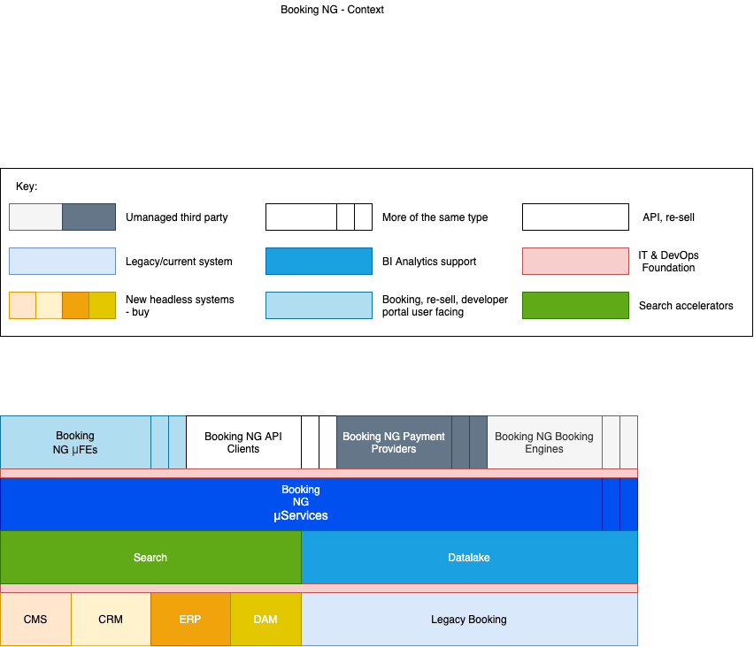
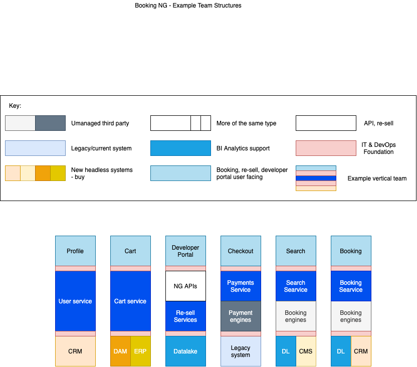
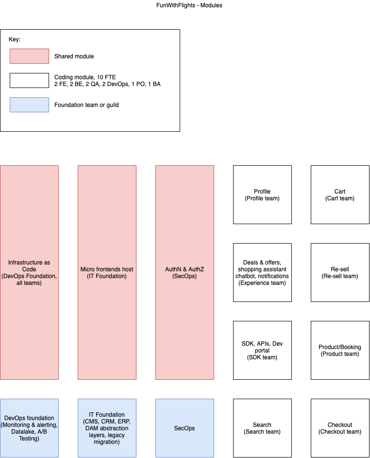
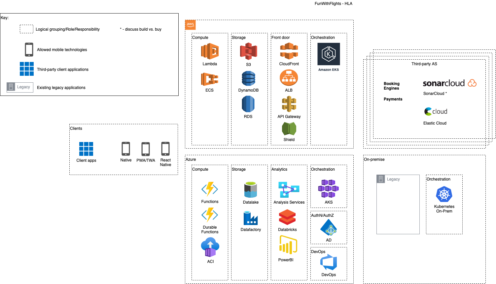
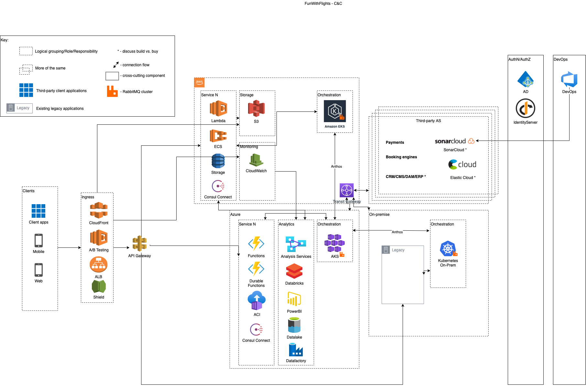

# BookingNG
---
## Sample µFrontend, BFF and µService
---

### booking-ng-frontend-product

Next.js application to be wrapped in a µFrontend shell

### booking-ng-frontend-product-bff

Node.js BFF application

### booking-ng-providers-service

.NET provider service/abstraction layer

###### Running the playground environment:
`docker-compose up`

- Frontend available on http://localhost:3000
- BFF available on http://localhost:3001
- µService available on http://localhost:3002/

###### Views:

---

---

---

---

